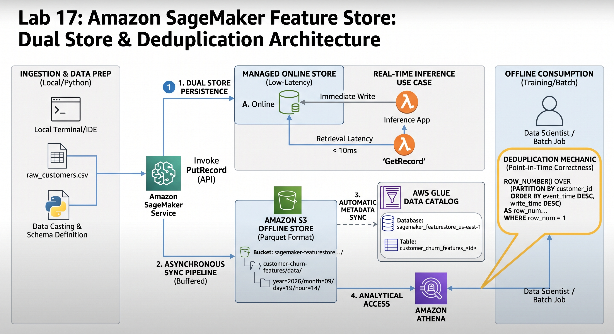

# Lab 17: Amazon SageMaker Feature Store — Dual-Store Architecture & Deduplication

## Architecture Overview



This project implements a dual-store feature repository using **Amazon SageMaker Feature Store** to eliminate training-serving skew across real-time inference and offline model retraining workflows. The architecture coordinates a low-latency key-value store for sub-10ms real-time inference with an append-only, Parquet-backed offline store on Amazon S3 for historical time-travel analysis and model retraining.

---

## Architectural Components

### 1. Ingestion & Contract Typing (`ingest_features.py`)
* **Schema Definition**: Explicitly typed numerical and categorical features using the three native SageMaker Feature Store data types: `Fractional`, `Integral`, and `String`.
* **Record Identifier & Event Time**: Configured `customer_id` as the primary entity identifier and injected UTC POSIX timestamps as `event_time` to establish the temporal baseline for all point-in-time queries.
* **Synchronous Dual-Store Dispatch**: Executed `PutRecord` batch calls to simultaneously populate the online low-latency cache and trigger the asynchronous sync pipeline.

### 2. Managed Online Store (Low-Latency Serving)
* **Storage Engine**: Fully managed SSD/key-value storage optimized for high-throughput, real-time feature reads.
* **Operational SLA**: Consistent sub-10ms retrieval via the `GetRecord` API.
* **Serving Contract**: Maintains solely the latest feature vector per entity to minimize memory bloat and support low-latency inference endpoints.

### 3. Asynchronous Offline Store Sync (Amazon S3 & Parquet)
* **Append-Only Immutability**: All updates and soft deletions (`is_deleted = true`) are buffered and committed as new rows with system-generated `write_time` metadata. Historical rows are never modified in place.
* **Eventual Consistency Window**: Ingested records buffer internally before micro-batching into S3 in Apache Parquet format (typical synchronization window of 5–15 minutes).
* **Automated Date Partitioning**: Objects are automatically partitioned hierarchically by date (`year=YYYY/month=MM/day=DD/hour=HH/`) to optimize analytical query performance and cost.

### 4. AWS Glue Catalog & Athena Deduplication (`dedup_offline_store.py`)
* **Metastore Synchronization**: SageMaker registers schema and newly written S3 partitions directly in the AWS Glue Data Catalog (`sagemaker_featurestore` database).
* **Point-in-Time Correctness**: Addressed historical record accumulation and prevented future data leakage by executing partition ranking queries via Amazon Athena:
  ```sql
  WITH ranked_features AS (
      SELECT 
          customer_id,
          churn,
          total_day_minutes,
          customer_service_calls,
          event_time,
          write_time,
          is_deleted,
          ROW_NUMBER() OVER (
              PARTITION BY customer_id 
              ORDER BY event_time DESC, write_time DESC
          ) AS row_num
      FROM "sagemaker_featurestore"."<glue_table>"
  )
  SELECT *
  FROM ranked_features
  WHERE row_num = 1 AND is_deleted = false;
